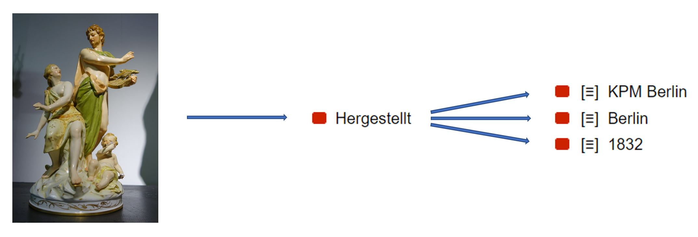
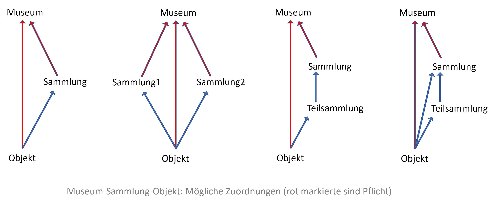

# Grundlegende Konzepte / Struktur der Daten

Das Objekt als Ausgangspunkt
------------------------

Ausgangspunkt der Datenstruktur von museum-digital ist das (Museums-)
Objekt. Was dabei als ein einzelnes Objekt betrachtet wird, das bleibt
dem jeweiligen Museum überlassen. Die Erschließungstraditionen sind
durchaus unterschiedlich: Manche Museen erfassen Bild und Rahmen
getrennt, andere Museen sehen darin eine Einheit.

Der Grundeinheit \"Objekt\" können nun verschiedene Dinge zugeordnet
werden. Eine einzige Zuordnung ist dabei Pflicht: Jedes Objekt muss
einem Museum zugeordnet werden. Wer Objekte öffentlich sichtbar machen
möchte, der muss überdies dem Objekt (mindestens) eine Ressource
zuordnen. Weitere Zuordnungen sind natürlich sinnvoll, werden aber vom
System nicht unbedingt verlangt.

Ausgangspunkt für die Gestaltung der Datenstruktur bei museum-digital
ist die an das CIDOC CRM angelehnte Struktur des Datenaustauschformates
LIDO. Ein wesentliches Element von LIDO ist der Umgang mit
(objektbezogenen) Ereignissen. Solche Ereignisse können die Herstellung,
die Nutzung, \... des Objektes sein.

Ereignisse
----------

Jedes (objektbezogene) Ereignis hält etwas fest, das mit dem Objekt
geschah. Ereignisse werden aus mehreren Elementen gebildet, die
Antworten auf die Fragen WAS-WER-WO-WANN geben. Zwingend ist dabei immer
eine Angabe des \"WAS\", der Ereignistyp. \"Herstellung\" ist ein
solcher Ereignistyp. Wenn jetzt einem Objekt ein Ereignis vom Typ
\"hergestellt\" zugeordnet wird, dann wird zwar ausgesagt, dass dieses
Objekt hergestellt wurde - aber das ist in den meisten Fällen ohnehin
klar und muss nicht erfasst werden. Mindestens eine weitere Angabe von
\"WER\" oder von \"WO\" oder von \"WANN\" ist nötig. Ein Ereignis
verknüpft letztlich einen Akteur, einen Ort oder eine Zeit mit einem
Objekt und es hält fest, worin diese Verknüpfung besteht. Eine
\"Kaffeekanne\" (=Objekt) kann \"hergestellt\" (=Ereignistyp) worden
sein von der \"Königlichen Porzellanmanufaktur Berlin (KPM)\"
(=Ereignis-Akteur). Dieses Geschehen (die \"Herstellung\") kann in
\"Berlin\" (=Ereignis-Ort) oder an einem anderen Produktionsort der
Manufaktur stattgefunden haben (die KPM produzierte in der
Nachkriegszeit in Selb) und das Geschehen wird zu einer bestimmten Zeit
stattgefunden haben, beispielsweise \"1803\" (=Ereignis-Zeit).

 Jedes Objekt lässt sich mit beliebig vielen Ereignissen verknüpfen.
Wenn beispielsweise bekannt ist, dass jemand Bestimmter
(=Ereignis-Akteur) das Objekt \"genutzt\" (=Ereignistyp) hat und jemand
Anderer (=Ereignis-Akteur) dieses Objekt zu einem späteren Zeitpunkt
(=Ereignis-Zeit) ebenfalls \"genutzt\" (=Ereignistyp) hat, so werden
einfach zwei Nutzungsereignisse erfasst und jeweils dem Objekt
verknüpft. Ein vollständiges Ereignis ist also ein bestimmtes Geschehen,
das von einem bestimmten Akteur an einem bestimmten Ort zu einer
bestimmten Zeit vorgenommen wurde. Wenn, was bei Büchern häufiger der
Fall ist, ein zweiter Ort ins Spiel kommt, weil das Objekt (Buch)
beispielsweise an zwei Orten \"veröffentlicht\" wurde, dann bildet dies
ein separates Ereignis - das Objekt steht damit sowohl mit dem einen als
auch dem anderen Ort in einer Beziehung.

Die Aufspaltung in Ereignisse und ihre Elemente hat zur Folge, dass es
bei museum-digital keine einfache \"Datierung\" eines Objektes gibt,
vielmehr gibt es beliebig viele \"Datierungen\" von Ereignissen, die
einem Objekt zugeordnet werden. Es kann sowohl die
\"Vorlagenerstellung\", die \"Herstellung\" oder die \"Nutzung\" datiert
werden. Auf diese Weise werden die Informationen zum Objekt wesentlich
gründlicher erfasst als in einem einfachen - zumeist nicht näher
definierten - Feld \"Datierung\", wie es noch in vielen Datenbanken
alter Art zu finden ist.

### Ereignistyp

Damit die Datenbank sinnvolle Antworten auf Anfragen wie \"Alle Objekte,
die in Berlin hergestellt wurden\" oder \"Alle Objekte, die 1832 in
Berlin hergestellt wurden\", \... geben kann, ist es nötig, den
\"Ereignistyp\" zu kontrollieren. Im Augenblick gibt es 43 verschiedene
\"Ereignistypen\" bei museum-digital. Eine Liste findet sich
[hier](./Ereignistypen.md).

### Akteure

Akteure sind die Hersteller, Nutzer, Verfasser, \... von Objekten. Es
sind Personen oder Körperschaften, die in einer (durch ein Ereignis
beschriebenen) Beziehung zu einem Objekt stehen. Der Akteur wird bei
museum-digital als separate Einheit erfasst (d.h. unabhängig von
Objekten oder Beziehungen). Der gleiche Akteur kann über viele
Ereignisse zu vielen Objekten in Beziehung gesetzt werden. Mehr über den
Umgang mit Akteuren findet sich [hier](./Akteure.md).

### Orte

Wie Akteure, so werden auch Orte bei museum-digital separat erfasst. Ein
und derselbe Ort kann zu vielen Objekten in Beziehung stehen. Als Ort
wird dabei nicht eine Ortschaft verstanden, sondern ein Platz im Raum:
Es ist sowohl möglich Regionen zu benennen (\"Westerwald\") als auch -
sofern bekannt - \"hausnummergenau\" (Beispiel: \"Berlin-Charlottenburg,
Weygelystraße 1\") zu erfassen. Mehr über den Umgang mit Orten findet
sich [hier](./Orte.md).

### Zeiten

Auch Zeiten werden separat erfasst. Verbale Zeitangaben sind oft
trügerisch. Begriffe wie \"Nachkriegszeit\" sagen nicht, auf welchen
Krieg diese Zeit folgte, \"Barock\" wird oft als Zeit gedacht bezeichnet
jedoch einen Stil, der in verschienen Regionen zu verschiedenen Zeiten
ausgeprägt war, selbst \"Jungsteinzeit\" oder \"Tertiär\" sind keine
eindeutigen Begriffe weil die Fachwissenschaftler häufiger deren Anfang
oder Ende neu definieren und sich ohnedies nicht einig sind. Es mussten
deshalb [Regeln für den Umgang mit Zeitangaben bei museum-digital
eingeführt werden](./Zeiten.md).

Bezüge
------

Bisweilen steht ein Objekt in einer nicht näher zu bestimmenden
Beziehung zu einem Akteur, einem Ort oder einer Zeit: Sei es, dass das
Objekt - wie kaum ein anderes - einen Ort versinnbildlicht (wie
beispielsweise der \"Berliner Bär\") oder in seinem Design den Zeitgeist
und Geschmack der \"1950er Jahren\" in prägnanter Weise spiegelt \... In
solchen Fällen können zwischen Akteuren, Orten, Zeiten einerseits und
Objekten andererseits direkte, d.h. allgemeine, nicht näher bestimmte,
Bezüge gespeichert werden. Was gerade über Akteure, Orte und Zeiten
gesagt wurde, gilt auch in diesem Fall.

Museum und Sammlung(en)
-----------------------

Jedes Objekt kann - muss aber nicht - zu einer oder mehreren Sammlungen
gehören. In den meisten Fällen wird ein Objekt genau einer Sammlung
zugeordnet, aber das Datenmodell von museum-digital
ist flexibel - es gibt Museen, die traditionell ihre Objekte mehreren
Sammlungen zuordnen und es gibt Museen, die ganz auf
Sammlungszuordnungen verzichten. Jede Sammlung wiederrum kann weitere
Sammlungen umfassen oder Teil einer übergeordneten Sammlung ein. So kann
etwa eine Sammlung \"Gemälde\" die Teil-Sammlungen \"Niederländische
Malerei\", \"Flämische Malerei\", \... enthalten. Ein zu einer
Teilsammlung gehörendes Objekt kann - muss aber nicht - der
übergeordneten Sammlung ebenfalls zugewiesen werden.  Jede Sammlung
muss, wie schon die Objekte, einer Institution zugeordnet werden.

Abbildungen etc.
----------------

Jedem Objekt können beliebig viele Ressourcen zugeordnet werden.
Ressourcen können Abbildungen, Videoaufzeichnungen, Tonaufzeichnungen
oder Texte (in PDF-Format) sein. Jede Ressource muss zwingend mit
rechtlichen Angaben (Rechteinhaber, Rechtestatus) versehen sein. Den
Ressourcen können weitere Informationen über die Ressource selbst
zugeordnet werden. Die maximale Größe der einzelnen Ressourcen wurde im
Lauf der Zeit erhöht. Abbildungen, Tonaufzeichnungen und Textdokumente
können bis zu 10 MB pro Ressource umfassen, Videoaufzeichnungen bis zu
40 Megabyte. Die Ressourcen werden beim Heraufladen umbenannt (um
Namensgleichheiten zu vermeiden) und in verschiedenen Größen
gespeichert.  Bei Abbildungen werden zudem die zum Zeitpunkt des
Heraufladens erfassten Objektinformationen automatisch als IPTC-Daten in
die Bilddateien selbst hineingeschrieben - wenn man so will: Ein
unsichtbares Wasserzeichen.

Sind die Ressourcen im Internet abrufbar so müssen sie nicht zu
museum-digital heraufgeladen werden. In diesem Fall kann stattdessen die
Internet-Adresse der Ressource gespeichert werden. Voransichten in
verschiedenen Größen werden bei der Zuordnung automatisch generiert. Für
Rechteangaben zu den Ressourcen und für Zusatzinformationen zu denselben
gilt das gleiche wie beim Heraufladen. Wenn Ressourcen verlinkt statt
heraufgeladen werden, so werden - selbstverständlich - keine IPTC-Daten
in Bilddateien geschrieben.

Literatur
---------

Jedem Objekt können beliebig viele gedruckte Quellen zugeodnet werden.
Die gleiche Quelle kann weiteren Objekten zugeordnet werden ohne sie
erneut zu erfassen. Die Literaturangaben werden nicht zentral
gespeichert - die Art Literatur zu erfassen ist in den einzelnen Museen
recht unterschiedlich. Museum-digital orientiert sich an
bibliographischen Vorgaben, d.h. Autor, Jahr, Titel, Erscheinungsort
werden getrennt erfasst und sind für einen Literatureintrag Pflicht.
Hinzu kommt die Möglichkeit die Identifikationsnummer der Quelle in der
Nationalbibliothek, die ISBN (so vorhanden), den Pfad zu einer digitalen
Kopie und museumsspezifische Kürzel zu erfassen. Es besteht auch die
Möglichkeit einen Link zu einer Abfrage im Karlsruher Virtuellen Katalog
zu speichern. Ein solcher Link erlaubt den Nutzern bei der öffentlichen
Ausspielung leicht zu erfahren, in welcher Bibliothek die entsprechende
Quelle vorhanden ist. Es ist möglich sämtliche Literatur des Museums
selbst mit museum-digital zu verwalten.

Wird eine Zuordnung zwischen einem Objekt und einer Quelle getroffen, so
kann das allgemein geschehen (etwa: \"In diesem Buch ist das Objekt
thematisiert\"), die Zuordnung kann aber auch genauer gefasst werden
(etwa: \"In diesem Buch wird das Objekt auf Seite 45 thematisiert\").

Web und Dokumente
-----------------

Beliebig viele Internetquellen können einem Objekt zugeordnet werden.
Festgehalten wird dabei jeweils ein Anzeigetext (den die Nutzer lesen
und dann anklicken) und die Internetadresse der Online-Quelle. Wie auch
gedruckte Quellen werden die Internetquellen für jedes Museum einzeln
erfasst. Eine einmal erfasste Online-Quelle ist mit beliebig vielen
Objekten - ohne sie erneut zu erfassen - verknüpfbar. Auf gleiche Weise
können Dokumente (PDF, maximal 4 MB) heraufgeladen und mit beliebig
vielen Objekten verknüpft werden.

Einzelverweise
--------------

Zu jedem Objekt lassen sich Einzelverweise (wechselseitig) zu einem
anderen Objekt bei museum-digital speichern. Ein Objekt wird dabei einem
zweiten zugeordnet ohne dass daraus eine Gruppe gebildet wird. Wenn man
die Zuordnung von Objekt A zu Objekt B speichert fragt die Software
nach, ob auch von Objekt B zu Objekt A verwiesen werden soll. In jedem
Fall wird neben der Zuordnung (A \> B und möglicherweise B \< A) ein
kurzer Text gespeichert, der öffentlich angezeigt wird und den Nutzern
die Zuordnung als anklickbaren Link anbietet. Das können z.B. Hinweise
sein wie \"Ein fast identisches Objekt\" oder \"Ein mittels dieses
Pinsels erstelltes Gemälde\" \... wobei unter dem Gemälde ein Link mit
dem Text \"Der Pinsel, mit welchem dieses Gemälde gemalt wurde\"
erscheinen könnte.

Objektgruppen
-------------

Ein Objekt kann auch einer beliebigen Objektgruppe zugeordnet werden.
Objektgruppen selbst müssen immer einem Museum zugeordnet werden und
können beliebig viele Objekte des Museums (aber nicht anderer Museen)
aus beliebigen Sammlungen des Museums umfassen. Objektgruppen können auf
verschiedene Art dargestellt werden, die bevorzugte Darstellungsweise
wird gemeinsam mit Titel und Beschreibung der Objektgruppe gespeichert.
Objektgruppen selbst können zudem mit einem Klick sichtbar oder
unsichtbar geschaltet werden. Auf diese Weise lassen sich Gruppen
bilden, die vornehmlich der Objektverwaltung dienen (etwa eine
\"unsichtbare\" Gruppe aller Objekte, die man an ein Portal exportiert).
Die Zuordnung von Objekten zu einer \"unsichtbaren\" Objektgruppe wird
nicht öffentlich angezeigt.

Schlagworte
-----------

Beliebig viele Schlagworte können den einzelnen Objekten zugeordnet
werden. Schlagworte verbessern die Suchresultate. Steht in einer
Objektbeschreibung etwa, dass es sich bei diesem Objekt \"nicht um einen
Helm\" handelt so würde eine einfache Suche nach der Buchstabenfolge
\"helm\" das Objekt finden. Durch Schlagworte werden automatisch
Übersichtsseiten generiert (\"Alle Objekte zum Schlagwort \'Helm\'\"),
die das Ranking bei Suchmaschinen verbessern. Schlagworte sollten immer
nur in der Sprache der jeweiligen Version von museum-digital verwendet
werden (Übersetzungen nimmt die Normdatenredaktion vor), sie sollten im
Singular sein und es sollte sich um Allgemeinbegriffe (Nomen) handeln.
Personen und Körperschaften (\"Akteure\"), Orte und Zeiten werden nicht
als Schlagworte behandelt, sie sollten wenn möglich über Ereignisse
(s.o.) oder - bei einer allgemeinen Beziehung zum Objekt - als Bezüge
(s.o.) behandelt werden.
