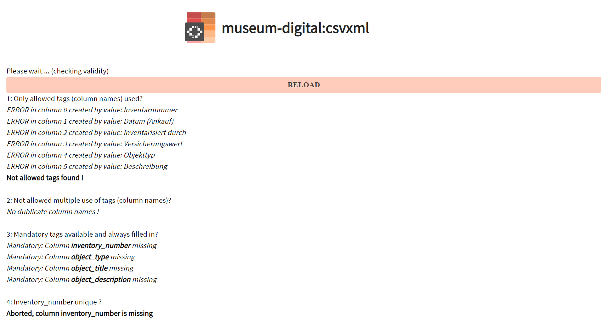
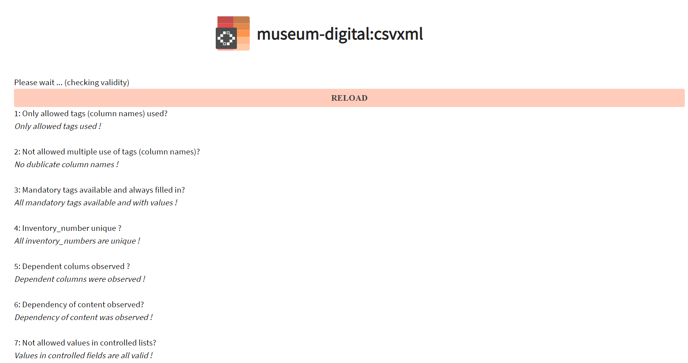

# CSVXML

Beim Import muss das Team von museum-digital wissen, welche Daten in
welches Datenfeld importiert werden sollen. Damit die Daten importiert
werden können, muss die erste Zeile der CSV-Datei in jeder Zelle so
benannt sein wie das Datenfeld in museum-digital, in das die Daten
dieser Zelle übertragen werden sollen. museum-digital hat aktuell rund
880 Datenfelder. museum-digital bietet eine CSV-Vorlage an, die Sie
selbst herunterladen können. Sie enthält die Namen aller Datenfelder auf
Englisch und Deutsch.

[**\> Hier geht es zur CSV-Vorlage sowie zum
Prüfassistenten.**](https://csvxml.imports.museum-digital.org)

Sie können entweder eine Vorlage mit allen Datenfeldern, eine Vorlage
mit den vier Pflichtfeldern (Inventarnummer, Objektart, Objektname,
Beschreibung) oder eine Vorlage mit selbst definierten Datenfeldern
durch Anklicken der gewünschten Datenfelder
herunterladen.

Auf der oben verlinkten Webseite können Sie im oberen Bereich außerdem
eine eigene CSV-Datei hochladen und es wird geprüft, ob sie alle
Anforderungen für den Import erfüllt. Dieser Prüfassistent ist aktuell nur auf
Englisch verfügbar.

Neben der Benennung der Spalten wird beispielsweise auch überprüft, ob alle
vergebenen Inventarnummern einzigartig sind oder ob es Abbildungen gibt, die
hochgeladen werden sollen.

Bei dieser CSV-Datei gibt es zahlreiche Fehler, die zu beheben sind.

[

Bei dieser CSV-Datei wurden keine Fehler gefunden.

Wenn alles passt, klicken Sie auf „CREATE XML FOR MD:IMPORT (UTF8)". Im
Anschluss können Sie die importfertigen Dateien als ZIP-Datei
herunterladen.

Schicken Sie die CSV-Datei sowie die ZIP-Datei zusammen mit den Bilddateien an Ihre\*n Regioadministrator\*in, die dann den Import veranlassen oder Ihnen eine Rückmeldung mit Tipps zur Korrektur geben, wenn die Daten nicht importiert werden können.

In dieser CSV-Datei enthält Zeile 1 die Namen der englischsprachigen
Datenfelder für museum-digital, Zeile 2 (rot) die deutschen
Übersetzungen der Datenfelder. Zeile 2 muss vor dem Erstellen der
XML-Dateien noch gelöscht werden. Die Zeilen 3 bis 5 enthalten drei
Datensätze, jede Zelle enthält dabei nur die Information, die in das in
Zeile 1 benannte Datenfeld importiert werden soll.

