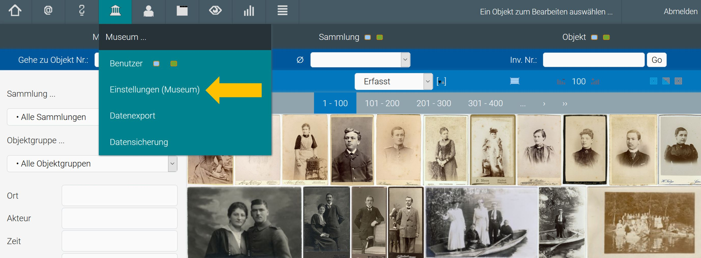

# Einstellungen (Museum)

Einstellungen für das Museum kann nur jemand in der Rolle "Museumsdirektor" vornehmen. Ist jemand mit dieser Rolle angemeldet so erscheint in der Navigationsleiste das Symbol "Museum". Bei Berührung mit dem Mauszeiger öffnet sich ein Aufklappmenü:

Hat der "Museumsdirektor" den Punkt "Einstellungen (Museum)" ausgewählt, so erscheint das entsprechende Eingabefenster mit mehreren Optionen:

## Rechteangaben für Objektdarstellungen

An dieser Stelle können Vorgabewerte für das Heraufladen von Abbildungen oder anderen Ressourcen gesetzt werden. Jede Ressource hat eigene ihr anhaftende Rechte. Sobald eine Ressource zu einem Objekt heraufgeladen (oder mit dem Objekt verknüpft) wird, verlangt das System Angaben zur Rechtesituation dieser Ressource. Die dort erscheinenden Eingabeschlitze sind jeweils vorausgefüllt mit den hier gesetzten Vorgabewerten. In den meisten Fällen ist der Rechteinhaber an den Abbildungen von Objekten das Museum selbst, deshalb ist hier der Museumsname vorausgefüllt. Die am häufigsten verwendete [Rechtsform](../../Grundkonzepte/Lizenzen.md) ist "CC BY-NC-SA" (Namensnennung - keine kommerzielle Verwendung - Weitergabe unter gleichen Bedingungen), auch dieses ist hier standardmäßig vorgegeben. Beide Werte können jedoch verändert werden, um andere Vorgabewerte für das Hochladen von Abbildungen zu setzen.
Beschäftigt ein Museum einen Fotografen, von dem die meisten der hochzuladenden Abbildungen stammen, so kann hier ebenfalls ein Vorgabewert gesetzt werden. Änderungen in den drei Feldern dieser Option wirken sich nicht auf schon vorhandene Abbildungen aus.

Der letzte Punkt dieser Option "[Fallweise ändern (Nur heraufgeladene Abbildungen)](../Objekte/Abbildungen/Bildlizenzen-Stapelbearbeitung.md)" führt bei Anklicken zu einer Übersicht der für die heraufgeladenen Abbildungen vorkommenden Rechteangaben. Jede einzelne
Kombination aus Rechteinhaber, Rechtestatus und Fotograf/Schöpfer läßt sich an dieser Stelle ändern. Vorgenommene Änderungen betreffen dann alle Abbildungen (und Ressourcen), für welche die entsprechende
Kombination zutraf. Auf diese Weise ist es leicht möglich, bei z.B. einem Namenswechsel des Museums auch zu allen Abbildungen einen neuen Rechteinhaber-Namen einzutragen oder bei einer Änderung der Grundsätze
im Museum selbst, für alle Abbildungen den Rechtestatus zu ändern.

## Rechte an (Objekt-)Metadaten

In der Sektion "Rechte an (Objekt-)Metadaten" geht es wiederum um Vorgabewerte für Rechtsangaben. An dieser Stelle geht es nicht um Rechte an Abbildungen oder Ressourcen, sondern um Rechte an den Informationen zu einem Objekt. Werden diese Felder nicht ausgefüllt, so wird als Rechteinhaber der Name des Museums eingetragen und der Rechtestatus mit CC BY-NC-SA angenommen. Die hier gesetzten, museumsweiten gültigen Vorgabewerte erscheinen auf der objektbezogenen Registerkarte "Rechte"
und können dort mit objektspezifischen Angaben überschrieben werden. "Rechte an (Objekt-)Metadaten" sind vor allem wichtig für Exporte an Portale, die diese Angaben verlangen.

## Nutzung von Social-Media auf dieser Plattform

Die Sektion "Nutzung von Social-Media auf dieser Plattform" enthält wiederum einen Vorgabewert. Dieser entscheidet bei Neueingaben darüber, ob die Nutzung von Social-Media auf museum-digital standardmäßig
erlaubt- oder untersagt ist. Zu jedem Objekt läßt sich der Eintrag jederzeit individuell im Rahmen der Objektbearbeitung ändern. Dort ist ein Schalter "Verberge SM-Buttons" zu finden, der den Vorgabewert der Einstellungen (Museum) übernimmt. Ist der "Verberge SM-Buttons"-Schalter auf "Nein" gesetzt so erscheint in der Anzeige des Objektes auf den Seiten von museum-digital kein Leiste mit Links zu Facebook, Twitter und Co.

Wenn ein Museum also diese Leiste zu einem einzelnen Objekt nicht angezeigt haben möchte, so schaltet es "Verberge SM-Buttons" auf ja. Will das Museum generell die Leiste bei keinem seiner neu erfassten
Objekte angezeigt haben, so wählt es unter Einstellungen (Museum) die Nutzung von Social-Media auf dieser Plattform ab.

## Darstellung der Inhalte auf Museumsseiten

Dieser Menüpunkt betrifft ausschließlich jene Museen, die ihre eigenen Objekte aus museum-digital über einen iframe einbinden. Einige grundsätzliche Gestaltungsmöglichkeiten für diese Option können hier
gesteuert werden, d.h. es wird das Erscheinen des aus museum-digital kommenden Inhalts gesteuert.

- Schalter "Sammlungsübersicht" anzeigen. Mit diesem Schalter wird bestimmt, ob im iframe der Museumsseite der Schalter und das betreffende Menü "Sammlungsübersicht" angezeigt wird. Steht dieser Schalter auf grün, wird also die Sammlungsübersicht angezeigt wird, so kann über die nächsten beiden Schalter bestimmt werden, wie sich ein Klick auf einen Eintrag im Menü "Sammlungsübersicht" innerhalb des iframes der Museumsseite auswirkt, soll dieser Klick zu einer (aus museum-digital in den iframe übermittelten) Sammlungsbeschreibung führen oder zu einer Übersicht der Objekte in der ausgewählten Sammlung?

- Unter jeder Sammlung kann bei museum-digital der Satz "... mehr über diese Sammlung im Internet" angezeigt werden, wenn entsprechende Dokumente oder Quellen verlinkt sind. Mit dem Schalter "Link unterhalb von Sammlungsbeschreibung ..." kann diese Möglichkeit für die iframe-Lösung abgeschaltet werden. In vielen Fällen würde sonst der Link unterhalb von Sammlungbeschreibung nur zur Museumsseite führen.

Für all jene Museen, die ihre Objekte über die API von museum-digital einbinden oder die auf eine Einbindung von Objekten in die Museumsseite verzichten ist die Option "Darstellung der Inhalte auf den Seiten von ..." ohne Belang.

## Dienste

Diese Sektion bietet einen Link zum Export-Dialog-System von museum-digital. Im Export-Dialog kann ausgewählt werden, welche Informationen zu welchen Objekten in welchem Format exportiert werden sollen. Mehr über das Export-Dialog-System findet sich [hier](../Objektsuche/Export.md).

Darüber hinaus gibt es hier die Möglichkeit einen Katalog aller Objekte des Museums zu erstellen. Aus technischen Gründen werden dabei jeweils Teil-Kataloge aus 50 Objekten erzeugt.
