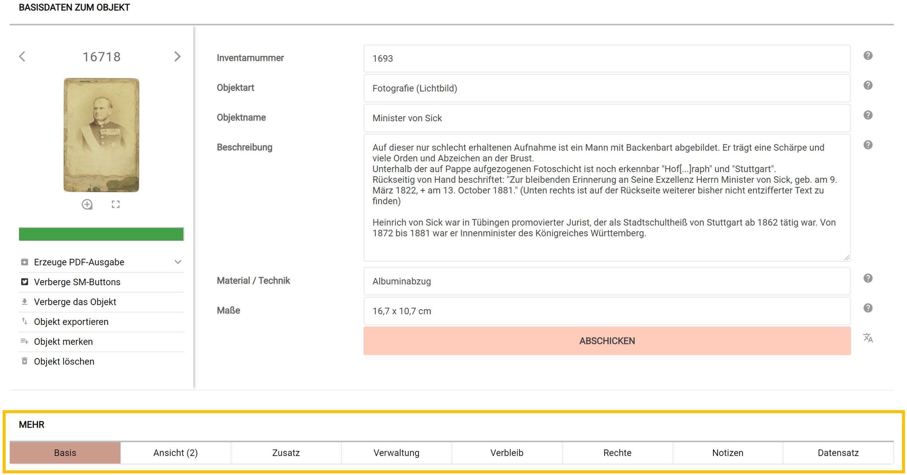

# Objekt-Basisangaben

Sobald die Grundinformationen zu einem Objekt erfasst sin, gelangen Sie
automatisch in den Objektbearbeitungsmodus. Um der Fülle von möglichen
weiteren Informationen über das Objekt etwas Struktur zu geben, sind
einzelne Informationen auf Registerkarten zusammengefasst. Diese
Registerkarten Sie sich im Menu \"Persönliche Einstellungen\" selbst an-
oder abschalten (Erläuterung finden sie
[hier](?lan=de&q=musdb/Benutzeroberfl%C3%A4che/Navigationsleiste)).
Museum-digital ist flexibel einsetzbar, wer es nur zur Veröffentlichung
von Objektinformationen verwenden möchte, der wird andere Informationen
erfassen als jener, der museum-digital vornehmlich als
Inventarisierungswerkzeug zur Objektverwaltung verwendet. Die zur
Verfügung stehenden Registerkarten sind in zwei Gruppen zusammengefasst:
\"Standardreiter\" und \"Zusatzreiter\". Die \"Standardreiter\" erlauben
ein einfaches Erfassen von sowohl Inventarisierungs- als auch von
Publikationsinformationen - sie werden an dieser Stelle erläutert.
Manche der \"Zusatzreiter\" erlauben das komplexere Erfassen einzelner
Aspekte, die in einfacher Form auch in \"Standardreitern\" eingetragen
werden könnten - jedes Museum kann dann entscheiden, welche der beiden
Eintragsmöglichkeiten verwendet werden soll. Andere der \"Zusatzreiter\"
erlauben zusätzliche Informationen zu erfassen, die - das ist abhängig
von der im Museum vorhandenen Art der Objekte - nur möglicherweise
vorhanden sein können (Ein Omnibus hat keine \"Transkription\" -
Fahrzeugmuseen werden die entsprechende Registerkarte wahrscheinlich
nicht aktivieren). Mehr zu den \"Zusatzreitern\" finden sie
[hier](?lan=de&q=musdb/Objektdaten/Objekte%20bearbeiten%20(2)).

Alle Registerkarten (\"Reiter\") erscheinen im Objektbearbeitungsfenster
unterhalb der Steuerelemente (links) und der Objekt-Grundinformationen
(rechts) in einer eigenen Leiste.

Standardreiter
--------------

Die \"Standardreiter\" oder \"Standardregisterkarten\" lauten \"Basis\",
zum Erfassen von Informationen, die - sollte das Objekt publiziert
werden - öffentlich werden sollen. Die Registerkarte \"Ansicht\" erlaubt
das Heraufladen und Verknüpfen von Abbildungen, Textdateien (PDF), Ton-
oder Videosequenzen oder von 3D-Elementen. \"Zusatz\" als Registerkarte
enthält mehrheitlich Elemente, die wahlweise veröffentlicht werden
können. Die vier Registerkarten \"Verwaltung\", \"Verbleib\", \"Rechte\"
und \"Notizen\" erfassen ausschließlich interne Informationen für die
Objektverwaltung, die nicht veröffentlicht werden können. Die
Registerkarte \"Datensatz\" informiert darüber, wer wann was erfasst
oder geändert hat - auch diese Registerkarte dient nur der internen
Information.
 
