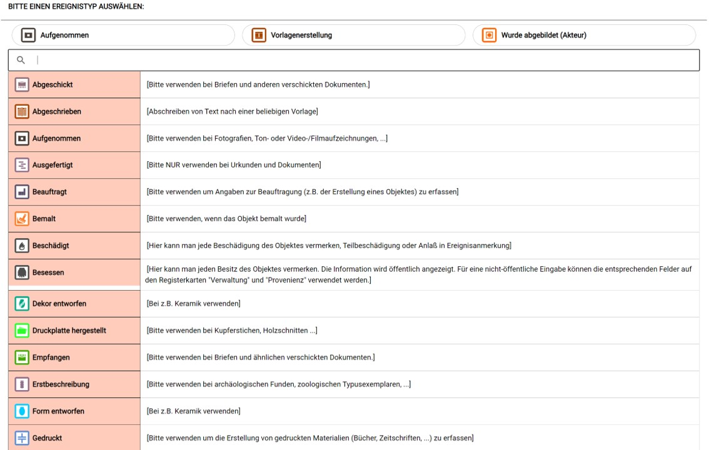
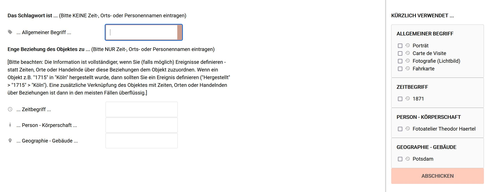
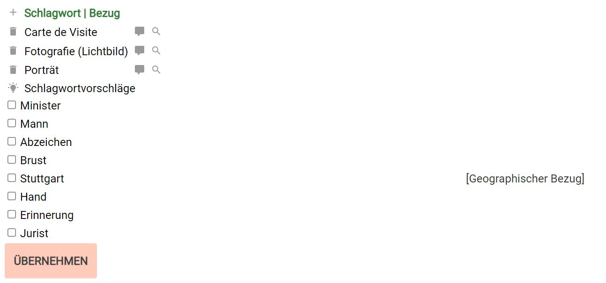
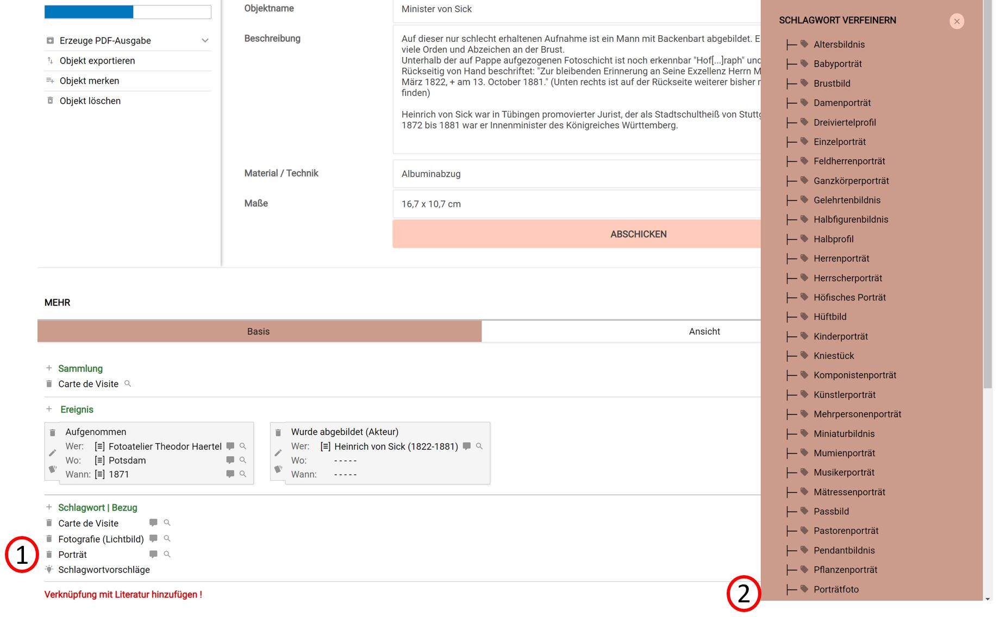

Registerkarte Basis
-------------------

Wenn alle anderen Registerkarten abgewählt wurden, dann erscheint die
Registerkarte \"Basis\" als eine Anreihung von Anweisungen in
dunkelroter Fettschrift - ergänzt durch eine Leiste zum Heraufladen oder
Verknüpfen von Abbildungen oder ähnlichen Ressoucen.

Sobald Sie die Registerkarte \"Ansicht\" aktivieren (im Menu
\"Persönliche Einstellungen - Erläuterung:
[hier](../../UI/Navigationsleiste.md)),
verschwindet die Leiste für Abbildungen etc. und ist fortan über diese
Registerkarte erreichbar. In der Standardeinstellung ist die
Registerkarte \"Ansicht\" aktiviert und die Registerkarte \"Basis\" hat
folgendes Aussehen:

### Verknüpfung mit Sammlung

Durch Anklicken der ersten Zeile können Sie das Objekt einer Sammlung
zuordnen. Direkt nach dem Anklicken erscheint eine Liste der bereits für
ihr Museum erfassten Sammlungen, die beispielsweise so aussehen kann:

(Sollte die Sammlung, der das Objekt zugeordnet werden soll noch nicht
existieren muss diese zunächst angelegt werden. Das wird
[hier](../../Sammlungen/README.md) erklärt.)

Durch einfaches Anklicken des Namens einer Sammlung erstellen Sie eine
Zuordnung zwischen dem Objekt und der ausgewählten Sammlung. Sie
gelangen automatisch in den Objektbearbeitungsmodus zurück, wo die
Verknüpfung dann eingetragen ist:

Mit der Zuordnung sind einige Symbole erschienen und die Schriftfarbe
hat sich für diese Zeile von Rot in Grün geändert. Das \"+\"-Zeichen vor
\"Sammlung\" ist ein Schalter mit dem Sie - auf die gleiche Weise, wie
gerade beschrieben - Zuordnungen zu weiteren Sammlungen herstellen
können. Ein Objekt kann problemlos, falls es die Strukturierung Ihres
Objektbestandes erfordert, zugleich mehreren Sammlungen angehören. Vor
dem Namen der verknüpfen Sammlung bietet das \"Mülleimer-Symbol\" die
Gelegenheit, die Verknüpfung zwischen Objekt und Sammlung zu löschen. Es
wird stets nur die Verknüpfung zwischen beidem gelöscht, nicht die hier
angezeigte Sammlung selbst. Die kleine \"Lupe\" hinter dem
Sammlungsnamen führt beim Anklicken zu einer Übersicht aller Objekte,
die dieser Sammlung zugeordnet sind.

###  Verknüpfung mit Ereignis

\"Ereignis\" ist an dieser Stelle etwas, das mit dem Objekt geschah,
seine Herstellung oder sein Auffinden beispielsweise. Ereignisse
enthalten Antworten auf die Fragen was, durch wen, wo und wann mit dem
Objekt geschah. Grundlegendes zu \"Ereignissen\" bei museum-digital
findet sich unter \"Struktur\" (oben) erläutert
([hier](../../../Grundkonzepte/Konzepte.md)). Um ein \"Ereignis\" mit einem Objekt
verknüpfen zu können muss dieses zunächst erfasst werden, das geschieht
durch Anklicken der Zeile \"Verknüpfung mit Ereignis hinzufügen\". Das
Anklicken führt zu einer Auswahlliste, mit der das \"WAS\" des
Ereignisses festgehalten wird.

Aktuell stehen 43 solcher Typen von Ereignissen zur Verfügung (eine
vollständige Auflistung aller vorhandenen Ereignistypen finden sie
[hier](../../../Grundkonzepte/Ereignistypen.md).) Ausgehend vom Eintrag im Feld
\"Objektart\" (im Beispiel: \"Fotografie (Lichtbild)\") ermittelt das
Programm Vorschläge der zu wählenden Ereignistypen, die aber in keiner
Weise zwingend sind. Sobald Sie den Ereignistyp durch Anklicken
ausgewählt haben erscheint das Formular zur vollständigen Erfassung
eines Ereignisses:

Im links erscheinenden Aufklappmenü kann der Ereignistyp geändert
werden. Im rechts erscheinenden Feld \"Kürzlich verwendet\" erscheinen
Akteure, Orte oder Zeitangaben, die Sie kürzlich verwendet haben. Ein
Klick auf die entsprechenden Einträge in diesem Feld ersetzt die Angaben
hinter \"Wer?\", \"Wo?\", \"Wann?\" an der richtigen Stelle. Speichern
lässt sich ein Ereignis nur dann, wenn wenigstens eine der Antworten auf
\"Wer\", \"Wo\" oder \"Wann\" gegeben wurde. Die entsprechenden schwarz
gefärbten Schaltflächen erlauben die jeweilige Erfassung. So führt ein
Klicken auf \"Wer?\" zur Aufforderung einen Akteur anzugeben:

Wenn Sie nun beginnen den Namen des Akteurs (im Beispiel ist es das
\"Fotoatelier Theodor Haertel\") einzutippen, dann erscheint eine
jeweils angepasste Liste der schon bei museum-digital erfassten Akteure.
Eintippen von \"H\" \"a\" \"e\" \"r\" \"t\" führt beispielsweise zu:

Wenn, was in diesem Beispiel der Fall ist, der Akteur in der Auswahlliste erscheint,
dann brauchen Sie den entsprechenden Namen nur durch Klicken auszuwählen
und gelangen automatisch zurück zur Vervollständigung der
Ereignisangaben \...

Sollte der Akteur noch nicht bei museum-digital bekannt sein, so
erbittet das Programm einige Zusatzangaben zur Identifizierung. Wichtig
ist, dass als Akteure nur \"individualisierbare Namen\" angegeben
werden, also nicht etwa \"A.F.\" oder \"Otto Müller\" - solche Angaben
können in Satzform in der Objektbeschreibung vermerkt werden. Tragen Sie
hier nur Personen oder Institutionen ein, über die Sie mehr wissen -
z.B. Lebensdaten, Beruf etc. Die Gefahr ist groß, dass sonst Ihr Objekt
mit dem falschen \"Otto Müller\" verknüpft wird. Ist Ihnen der Akteur
unbekannt, so tragen Sie bitte nicht \"unbekannt\" oder ähnliches ein,
verzichten Sie in diesem Fall einfach darauf, eine Person oder
Institution anzugeben (Mehr zur Erfassung bisher unbekannter Akteure
siehe [hier](../../../Grundkonzepte/Normdaten.md))

Egal, ob Sie einen Akteur im Ereignis ausgewählt oder neu erfasst haben,
Sie gelangen im Anschluß automatisch zur Vervollständigung der
Ereignisangaben.

Der Name des Akteurs wurde als Teil des Ereignisses erfasst, dass heißt:
Eine Verknüpfung zwischen dem Eintrag für den Akteur bei museum-digital
und dem Ereignis (der Aufnahme der Fotografie) wurde gespeichert. Vor
dem Namen erscheint das \"Mülleimer-Symbol\", mit welchem sie diese
Verknüpfung wieder löschen können (ohne dabei den Eintrag für das
Fotoatelier Theodor Haertel zu löschen). Zudem ist ein Äquivalenz-Symbol
in Form von drei eingeklammerten übereinander liegenden Strichen
erschienen. Dieses Symbol taucht stets auf, wenn es die Möglichkeit
geben muss auszudrücken, ob die Information gesichert und genau ist. In
seiner drei Striche-Form hat das Symbol die Bedeutung:
\"ist-genau-so-gemeint\". Ein Klick darauf führt zu einem Tilde-Symbol,
einer Schlangenlinie mit der Bedeutung: \"wahrscheinlich\" oder
\"circa\". Ein Klick auf das Tilde-Symbol lässt das Äquivalenzsymbol
wieder erscheinen. Die Symbole wirken wie ein An- und Ausschalter. Wenn
Sie das Tilde-Symbol ausgewählt haben, dann erscheinen die Angaben bei
der Veröffentlichung mit entsprechenden Zusätzen (Beispiel:
\"Fotoatelier Theodor Haertel (wahrsch.)\".

Nachdem nun neben dem \"Was\" auch eine weitere Angabe vorhanden ist,
kann - sofern keine weiteren Angaben bekannt sind - das Ereignis
gespeichert werden. Sind Angaben zu \"Wer\" oder \"Wann\" (der
entsprechende Akteur in genannter Weise in Bezug auf das Objekt gewirkt
hat) bekannt, so sollten diese unbedingt eingetragen werden. Das
geschieht für Orts- und Zeitangaben analog zu den beispielhaft
geschilderten Angaben zu einem Akteur. Schließlich können Sie das
Ereignis noch mit einer Anmerkung versehen. Das kann beispielsweise
sinnvoll sein, wenn es sich bei dem Objekt um einen Omnibus mit mehreren
Herstellern handelt. Sie können so in einem Ereignis erfassen
Wer-Wann-Wo das Chassis hergestellt hat (Anmerkung etwa: Herstellung des
Chassis) und in einem zweiten Ereignis festhalten Wer-Wann-Wo den Motor
produzierte (Anmerkung etwa: Herstellung des Motors).

Durch Klicken auf Abschicken gelangen Sie zurück zur Objektbearbeitung:

 Das Ereignis ist jetzt auf der Registerkarte \"Basis\" verzeichnet. Es
erscheint in einer Box mit einigen Symbolen. In der linken Spalte dieser
Box finden sich Symbol-Schalter, die das Ereignis als Ganzes betreffen:
Mit Klick auf das \"Mülleimer\"-Symbol lässt das Ereignis löschen, mit
Klick auf das \"Stift\"-Symbol lässt sich das Ereignis bearbeiten und
mit Klick auf das \"Bierkrug\"-Symbol lässt es sich Klonen. Neben dieser
Symbolspalte findet sich der Ereignistyp angegeben. Ein Klick darauf
führt, wie das \"Stift\"-Symbol der linken Spalte, zur
Ereignisbearbeitung. Unter dem Ereignistyp stehen die einzelnen
Einträge. Auch hier handelt es sich um Schalter. So führt ein Klicken
auf \"Wer:\" dazu, dass Sie einen änderen Akteur eintragen können, ein
Klicken auf \"Wo:\" gibt Ihnen Gelegenheit einen anderen Ereignisort
einzutragen. Analog dazu führt ein Klicken auf \"Wann:\" zu jener
Stelle, an der Sie einen anderen Zeiteintrag eintragen können. Zum
Ändern eines Ereignisses haben Sie also die Möglichkeit, entweder (Klick
auf \"Stift\"-Symbol oder auf Ereignistyp) das Ereignis als Ganzes zu
ändern oder gezielt ein Wer-Wo-Wann zu ändern. Rechts der
Wer-Wo-Wann-Spalte findet sich das gerade erläuterte Äquivalenz-Symbol,
als \"Unscharf\"-Schalter. Sie haben hier die gleiche Möglichkeit wie in
der Ereigniserfassungsmaske, ihre Information mit einem Zusatz für
\"Unschärfe\" (\"wahrscheinlich\", \"circa\", \...) zu ergänzen. Hinter
diesem Zeichen finden sich die jeweiligen Anträge.

Ein Klicken auf \"Fotoatelier Theodor Haertel\" führt Sie auf eine
Seite, auf welcher Informationen über diesen Akteur zusammengetragen
werden. Falls der Akteur \"Fotoatelier Theodor Haertel\" nicht mit
Objekten anderer Museen verknüpft ist, können Sie an dieser Stelle die
Informationen über den Akteur direkt ergänzen. Sollte der Akteur mit
Objekten mehrerer Museen verknüpft sein, dann kann - damit nicht der
Eine unkontrolliert die Daten der Anderen ändern kann - nur noch die
Normdatenredaktion Änderungen an den Informationen zum Akteur vornehmen.
Sie können aber jederzeit Anmerkungen zum Akteur als Hinweis an die
Normdatenredaktion eintragen, die dann versucht Ihre zusätzlichen
Informationen zu integrieren. Die Anmerkungsmöglichkeit erreichen Sie
auch über das Sprechblasensymbol direkt hinter dem jeweiligen Eintrag.
Schließlich findet sich jeweils eine Lupe am rechten Rand einer Zeile.
Über dieses Symbol erreichen Sie alle mit dem gleichen Akteur (oder Ort
oder Zeitbegriff) verknüpften Objekte, unabhängig vom Ereignistyp. Ein
Klick auf die Lupe hinter der Sprechblase in der \"Wo\"-Zeile des
Beispiel-Ereignisses zeigt alle ihre Objekte, zu denen Sie - über ein
Ereignis oder einen allgemeinen Bezug - vermerkt haben, dass Sie etwas
mit Potsdam zu tun haben.

### Verknüpfung mit Schlagwort \| Bezug

Ein Schlagwort ist ein allgemeiner Begriff, mit dem Sie das Objekt
verknüpfen können. Wenn Sie möchten, dass Ihr Objekt bei der Suche im
Internet nach beispielsweise \"Ohrensessel\" oder \"Trachtenjacke\"
gefunden wird, vor allem aber, wenn Sie es für Sich und andere in
museum-digital bei einem bestimmten Begriff finden möchten, so fügen Sie
den Begriff als Schlagwort oder Bezug ein. Schlagworte sind bei
museum-digital immer Substantive im Singular, mehr zu Schlagworten
finden Sie [hier](../../../Grundkonzepte/Schlagworte.md). Wichtig vielleicht
noch zu erwähnen, dass alle Suchen bei museum-digital \"inklusiv\"
arbeiten, wer \"Sessel\" sucht, der findet auch \"Ohrensessel\" und wer
\"Kleidung\" sucht, der findet auch \"Trachtenjacke\". Es ist deshalb
unnötig Hierarchien einzugeben und zum Objekt etwa \"Sessel\" neben
\"Ohrensessel\" oder \"Jacke\" neben \"Trachtenjacke\" einzugeben. Der
genauere Begriff sollte gewählt werden, die übergeordneten erschließen
sich aus der von der Normdatenredaktion erstellten Hierarchie
automatisch.

Eine besondere Form von Schlagworten sind die Personen-, Orts- oder
Zeitbezüge. Bestenfalls werden Beziehungen zwischen einem Objekt und
einer Person, einem Ort oder einer Zeiteinheit über Ereignisse
gespeichert, das gelingt aber nicht immer. Wenn beispielsweise \"A\"
einen Brief an \"B\" schreibt, in welchem er \"C\" zitiert, dieser habe
\"D\" besucht und dabei an \"E\" gedacht, nur um von \"D\" zu erfahren,
dass \"F\" (ehemals liiert mit \"E\") nicht mehr in \"G\" weile, sondern
vermutlich nach \"H\" verzogen sei und sich dort gemeinsam mit \"I\" an
die Übersetzung des Werkes von \"A\" ins Englische gesetzt habe, dass im
Verlag \"J\" in \"K\" noch im Laufe des Jahres \"L\" erscheinen solle
\... Die Wirklichkeit ist manchmal zu komplex für einfache
Datenstrukturen\". Wenn eine Beziehung zwischen einer Person (oder
Institution) und dem Objekt oder zwischen einem Ort und dem Objekt oder
einer Zeiteinheit und dem Objekt sich nicht über Ereignisse ausdrücken
lässt, dann sollten Bezüge gewählt werden.

Um das Objekt mit einem Schlagwort oder Bezug zu verknüpfen klicken Sie
auf die entsprechende Zeile der Registerkarte Basis. Es erscheint der
Schlagwort \| Bezug-Dialog.

Wie gerade geschildert wird strikt zwischen Schlagworten (oben
einzutragen) und Bezügen (unten einzutragen) unterschieden. Die
Erfassung von Schlagworten und Bezügen ist sehr ähnlich der Erfassung
von Ereignissen (s.o.). Entweder Sie wählen einen Eintrag aus der Liste
\"Kürzlich verwendet\" (oder mehrere durch setzen von Haken in dieser
Liste und anschließendes Abschicken) oder Sie tragen ein Schlagwort ein.
Auch hier erscheint während des Eintippens eine angepasste Liste schon
vorhandener Begriffe, aus der Sie auswählen sollten, wenn das von Ihnen
gewünschte dort erscheint. Ist das nicht der Fall, dann tippen Sie das
Schlagwort (oder den Bezug) vollständig ein und drücken die Enter-Taste.
Es kann passieren, dass das System noch ein paar Fragen stellt (abhängig
von dem, was sie eintragen - und nur um Fehleinträge zu vermeiden), in
jedem Fall aber gelangen Sie automatisch zurück zur Objektbearbeitung.

Falls Sie im Menu \"Eigene Einstellungen\" (wird hier erläutert) die
\"Schlagwortvorschläge\" aktiviert haben erscheint unterhalb der Zeile
\"Verknüpfung mit Schlagwort \| Bezug hinzufügen !\" oder unterhalb der
bereits verknüpften Schlagworte ein weiterer Schalter:

Wenn Sie diesen Schalter anklicken, dann wird ermittelt das System aus
den bisher erfassten Namen und Texten Vorschläge für Schlagworte oder
Bezüge und präsentiert sie in passender Form:

Nun können Sie - durch Setzen von Haken und anschließendes
\"Übernehmen\" diese Vorschläge annehmen. Die Fülle der Vorschläge hängt
wesentlich davon ab, wie gründlich zu diesem Zeitpunkt die
Objektbeschreibung erfolgte. Wenn Sie die erschienene Liste ignorieren,
dann verschwindet sie ohne Nachfrage.

Die Schlagworterfassung hat noch ein weiteres Feature: Ziel ist ja,
möglichst passende Schlagworte zu vergeben. Klicken Sie mit der rechten
Maustaste auf ein Schlagwort, so erscheint am rechten Bildschirmrand
eine Liste von diesem Schlagwort untergeordneten Begriffen.

 

Aus dieser Liste können Sie nun einen verfeinerten Begriff durch
Anklicken auswählen. Das ursprüngliche Schlagwort wird dabei durch das
feinere, besser passende, ersetzt.

### Verknüpfung mit Literatur

Bei museum-digital bestehen Literaturangaben grundsätzlich aus zwei
Teilen, der Angabe der jeweiligen Literatur und der Angabe einer Stelle
in dieser Quelle. Das hat den Vorteil, dass Literatureinträge nur einmal
erfasst werden müssen, wenn häufiger auf die gleiche Literatur verwiesen
wird - in diesem Falle ändert sich ja nur die Stelle innerhalb der
Literatur als Bezugspunkt. Das macht das Erfassen von Verknüpfungen zu
Literatureinträgen ähnlich dem Erfassen von Sammlungen. Ein Klick auf
\"Verknüpfung mit Literatur hinzufügen\" öffnet eine Übersicht der
bereits erfassten Literatur:

Aus dieser Übersicht können Sie, sollte die Literatur bereits erfasst
sein, durch Anklicken auswählen. Sie gelangen zurück zur
Objektbearbeitung, wo die Verknüpfung eingetragen ist. Dort finden Sie
am Ende der Zeile der Verknüpfung ein Buchsymbol

über das Sie durch Anklicken die jeweilige Stelle im Literatureintrag
vermerken können.

Sollte die Literatur bisher noch nicht erfasst worden sein, so klicken
Sie oben auf jener Seite, auf welcher die Übersicht der Einträge
erscheint, auf das dort befindliche \"+\". Es erscheint die
Literatur-Erfassungsmaske, die Sie gemäß den allgemein üblichen Regeln
ausfüllen sollten. Ein Klick auf das \"Abschicken\" in dieser Maske
führt Sie zurück zur Objektbearbeitung, wo dann - wie beschrieben - die
jeweilige Stelle in der Literatur erfasst werden kann.

Literatureinträge werden bei museum-digital immer pro Museum erfasst. Es
wäre eleganter, eine zentrale Verwaltung für Literatur einzurichten -
Versuche haben aber gezeigt, dass die Art und Weise, wie in Museen
Literatur erfasst wird, von Museum zu Museum deutlich variiert. Im
Ergebnis entstünde eine riesige Liste mit Einträgen, die mehrfach
vorliegen, weil der Eine sie so und die Andere sie anders eingegeben
hat. Effizient ist es, wenn wenigstens innerhalb eines Museums Einigkeit
beim Erfassen vorherrscht (z.B. Autornachname vor Autorvorname?). Am
Besten aber ist es, wenn Sie sich an den allgemein üblichen Regeln für
Zitieren in wissenschaftlichen Arbeiten orientieren.

### Weblink

Weblink

### Dokument

Dokument

### Einzelobjekt

Einzelobjekt

### Objektgruppe

Objektgruppe
