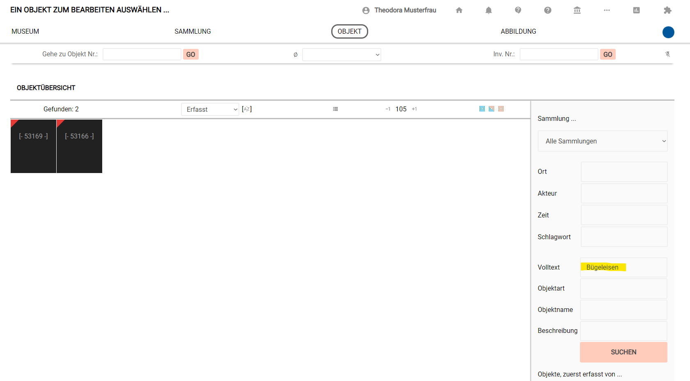
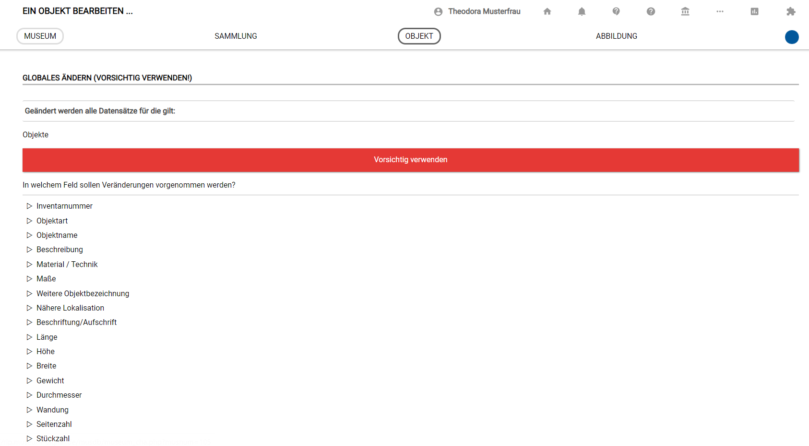
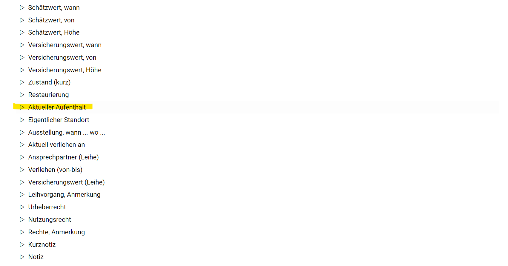

Globales Ändern (Stapelverarbeitung)
====================================

Wann benutzt man die Funktion „Globales Ändern"?
------------------------------------------------

Manchmal möchte man Einträge bei mehreren Objekten gleichzeitig
verändern. Ein klassischer Anwendungsfall ist beispielsweise ein
Depotumzug: Der Standort ändert sich bei allen Objekten, und zwar
beispielsweise von „Außendepot, Raum 1" zu „Außendepot, Raum 2". Wenn
hier mehrere Hundert Objekte umziehen, ist es mühsam, in jedem Datensatz
den Standort einzeln zu ändern. Und es ist auch nicht notwendig -- die
Funktion dafür heißt „Globales Ändern". Sie funktioniert wie eine
Stapelverarbeitung, um Änderungen schnell und gleichzeitig an mehreren
Datensätzen durchzuführen. Benutzer:innen, die die Funktion „Globales
Ändern" verwenden wollen, müssen mindestens die Nutzerrolle
"Museumsdirektor" haben.

> **Achtung! Das „Globale Ändern" ist eine mächtige Funktion.
> Änderungen, die man damit durchführt, lassen sich nicht mehr
> rückgängig machen! Man muss sehr sorgfältig sein und testet die
> Funktion besser erst bei einzelnen Objekten (oder besser sogar
> Testobjekten) aus.**

Wie aktiviert man die Funktion „Globales Ändern"?
-------------------------------------------------

Nutzer:innen, die mindestens die Nutzerrolle „Museumsdirektor" haben,
aktivieren die Funktion, indem sie im Menüband ganz oben auf ihren Namen
klicken und dann den Haken bei „Globales Ändern" durch Anklicken setzen.

Inhalte mit „Globales Ändern" bearbeiten
----------------------------------------

Nun muss man die Objekte auswählen, die geändert werden sollen. Dafür
geht man zunächst auf die normale Objektliste und filtert nach den
gewünschten Objekten, im Beispiel zum Beispiel alle Objekte, die im
Volltext das Wort „Bügeleisen" enthalten.

[**\> Hier wird erklärt, wie man den Filter
benutzt!**](../../Objektsuche/Filtern.md)

Scrollt man dann ganz nach unten, so findet man beim Filterbereich ganz
unten nun die Funktion „Globales Ändern". Ein Klick darauf öffnet diese.

 

Zunächst kann man nun das Feld auswählen, in dem Änderungen vorgenommen
werden sollen. Im Beispiel soll der Standort bei den beiden ausgewählten
Objekten im Feld „Aktueller Aufenthalt" von „Außendepot, Raum 1" zu
„Außendepot, Raum 2" geändert werden.

Weiter nach unten zum richtigen Feld scrollen.

Die Änderungen müssen in der Maske eingegeben werden.

Beim Klick auf „Abschicken" erscheint noch einmal eine Warnung mit dem
Hinweis, wie viele Datensätze geändert werden.

> **Achtung! Wer jetzt auf „So sei es!" klickt, der ändert die
> Datensätze unwiederbringlich!**

Die Kontrolle zeigt: Der Eintrag wurde bei beiden Datensätzen geändert.

