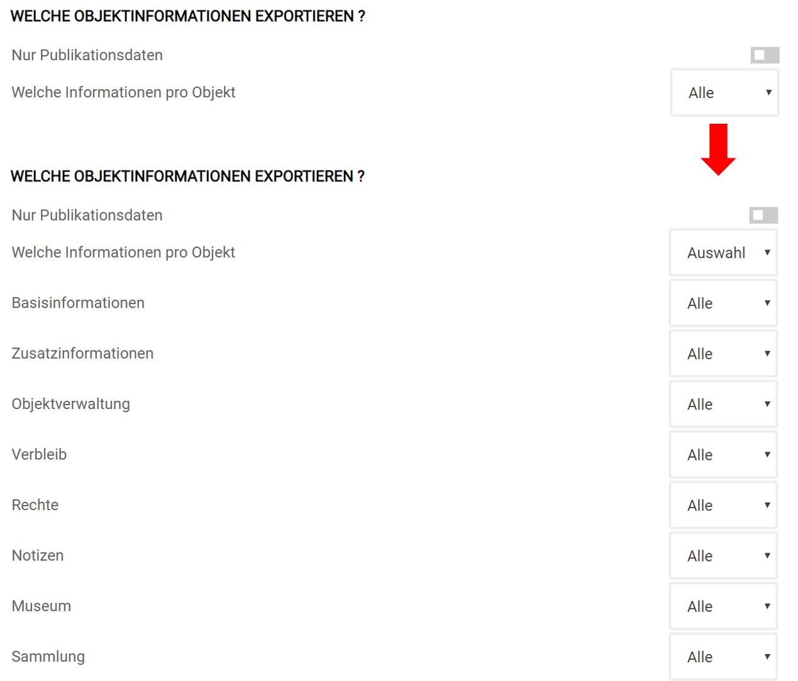
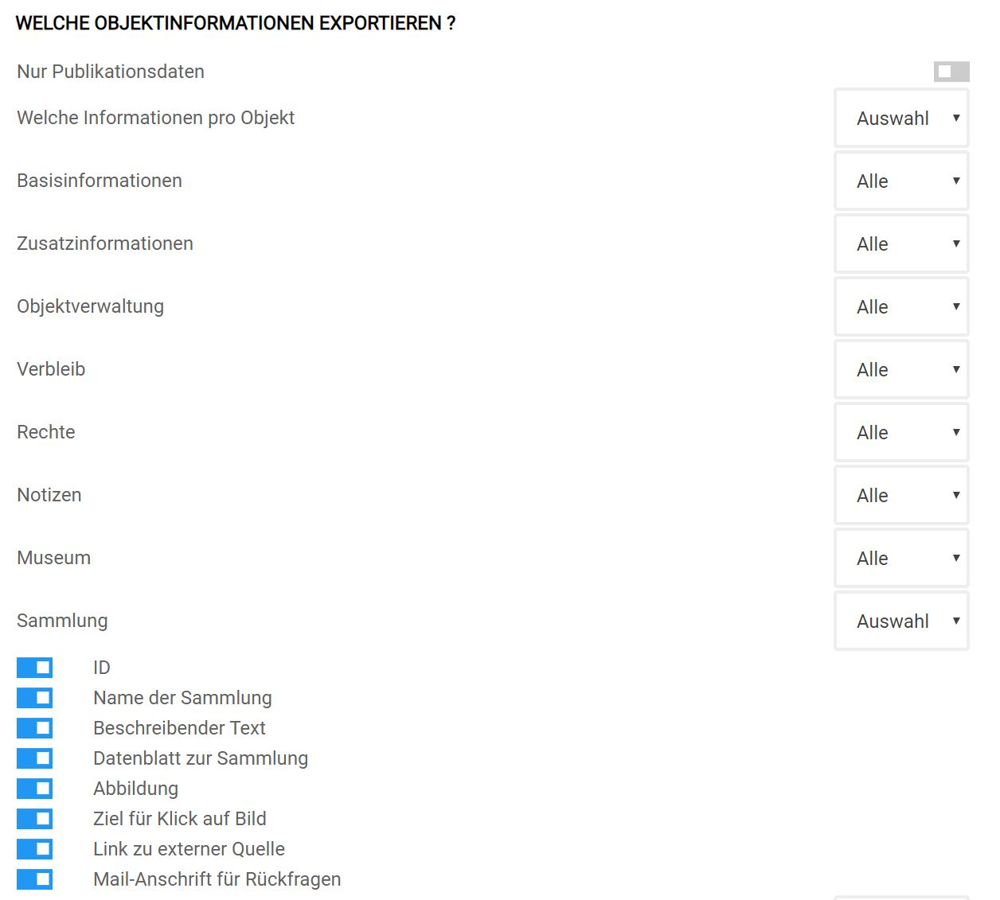
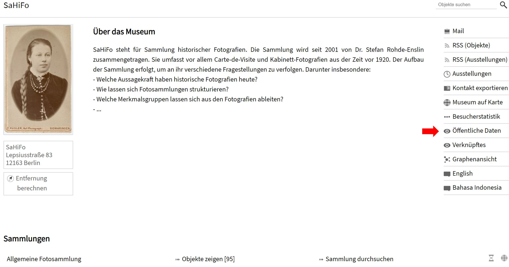

Exporte
=======

Vorbemerkung
------------

Beim Exportieren geht es in erster Linie um Sicherung und Weitergabe von
Daten. Exporte können im allgemeinen nur von Nutzern in der Rolle
\"Museumsdirektor\" angestoßen werden. Der Server stellt dann eine
passende Archivdatei zusammen und schickt sie an den Nutzer.

### Das Prinzip

Mindestens einmal wöchentlich wird eine Exportdatei mit den Objektdaten
jedes teilnehmenden Museums erstellt und auf dem Server von
museum-digital gespeichert. Diese Exportdatei ist, wenn nach ihrem
Erstellen Änderungen an Objektinformationen vorgenommen wurden, nicht
immer ganz aktuell. Es gibt deshalb stets zwei Wege für einen Export:
Zum einen den \"regulären Export\", bei dem der jeweils aktuelle Stand
der Informationen berücksichtigt wird, der aber - weil die Informationen
zu den Objekten erst zusammengetragen werden müssen, sehr viel Zeit in
Anspruch nehmen kann. Zum anderen gibt es den \"Schnellexport\", d.h.
die bereitliegende Exportdatei kann als Ganzes oder - wenn ein Filter
gesetzt ist - aus Teilen zusammengestellt werden.

### Die Exportformate

Für eine weitreichende Nutzbarkeit müssen die exportierten Daten
standardisierten Datenformaten entsprechen. Hierfür stehen aktuell zwei
Formate zur Auswahl:

\- *md:xml*, das museum-digital eigene Exportformat, welches die
vollständigen Informationen zu einem Objekt in möglichst einfacher Form
strukturiert, um auf diese Weise eine einfache Rekonstruktion aller
Informationen zu ermöglichen.

\- *LIDO*, das von einer Arbeitsgruppe der CIDOC (ICOM) entwickelt wird
und weltweit die Weitergabe von Museums-Objekt-Informationen an Portale
ermöglichen soll. Viele Portale arbeiten mit diesem Format, z.B. die
europeana, die Deutsche Digitale Bibliothek oder das sogenannte
Grafikportal. Mehr zu diesem Format findet sich auf der [Seite der
genannten
Arbeitsgruppe](http://cidoc.mini.icom.museum/working-groups/lido/what-is-lido/).
Da die Struktur der museum-digital-Datenbanken selbst weitgehend auf
denselben Konzepten wie LIDO basiert, ist es besonders leicht
LIDO-Exportdateien zu erzeugen.

### Zwei Möglichkeiten

\"Regulärer Export\" und \"Schnellexport\" unterscheiden sich nicht nur
in der Aktualität der Inhalte sondern auch darin, dass es beim
\"Schnellexport\" zwar möglich ist festzulegen, zu welchen Objekten
Informationen exportiert werden, nicht aber zu sagen, welche
Informationen pro Objekt im Export enthalten sein sollen. Beim
Schnellexport wird das vom Exportformat vorbestimmt und umfasst bei Wahl
von md:xml alle Objektinformationen (also auch alle Daten der
Inventarisierung), beim LIDO-Format hingegen nur für die Öffentlichkeit
bestimmte Daten (also keine Informationen über Standorte oder
Versicherungswerte etc.). Beim \"regulären Export\" kann bis auf Ebene
der Einzelinformation gewählt werden, ob diese im jeweiligen Export
enthalten sein soll oder nicht (innerhalb der Vorgaben des gewählten
Exportformates).

Export aller Objektinformationen
--------------------------------

Für den Export aller Datensätze kann es verschiedene Gründe geben, in
erster Linie eignet sich ein solcher Export zur Datensicherung.

### Datensicherung

Die vom Server geschickten Daten können im Museum auf einem lokalen
Rechner oder Speichermedium verwahrt werden. Zur Datensicherung
empfiehlt sich das md:xml-Datenformat, da alle Informationen zum Objekt
enthalten sind. Zur Datensicherung - und generell zum Datenexport -
gelangt ein Nutzer in der Rolle \"Museumsdirektor\" recht einfach, indem
er in der oberen Symbolleiste von musdb das Museumssymbol
(\"Einstellungen für das Museum\") mit der Maus überfährt und den Punkt
\"Datensicherung\" anklickt.

Er wird zu einem Hinweisbildschirm geleitet, der Auskunft darüber gibt,
ob nach dem Erstellen der auf dem Server bereitliegenden Exportdatei
noch Änderungen an den Objekten vorgenommen wurden.

Ist die bereitliegende Exportdatei jünger als die letzten Bearbeitungen,
dann ist sie aktuell und kann mit Klick auf \"Download\" heruntergeladen
werden. Gibt es jedoch jüngere Änderungen an Objekten, die in der
Sicherung enthalten sein sollen, muss der \"reguläre Export\" gewählt
werden. Statt Auswahl von \"Datensicherung\" im Untermenü zum
Museumssymbol ist in diesem Untermenü der Punkt \"Datenexport\"
auszuwählen. Was erscheint ist der Exportdialog für den \"regulären
Export\".

### Der Exportdialog

In diesem Dialog kann bestimmt werden:

-   welche Datensätze (Auswahl von Sammlungen oder Objektgruppen),
-   welche Information pro Objekt (Auswahl einzelner Felder) und
-   in welchem Exportformat exportiert werden soll.

Die Grundeinstellung sorgt dafür, dass alle Datensätze (also auch die
nicht veröffentlichten) mit allen Informationen zu jedem Objekt (also
auch die Inventarisierungsangaben) im Format md:xml exportiert werden.
Wer in diesem Menü keine andere Auswahl trifft und einzig auf
\"Abschicken\" klickt, der veranlasst den Server einen ZIP-Ordner mit
allen aktuellen Informationen zu allen Objekten zu erstellen und zum
Herunterladen anzubieten. Wer also einen ganz aktuellen Export für die
Datensicherung braucht, der gehe diesen Weg. Es kann jedoch, abhängig
von der Anzahl der Objekte und der Reichhaltigkeit der erfassten
Informationen, recht lange dauern, bis der Server alle Informationen
zusammengestellt, formatiert und im ZIP-Ordner gesammelt hat. Es kann
sogar vorkommen, dass dabei die maximale Laufzeit für ein Script auf dem
Server, die aus Sicherheitsgründen niedrig gehalten wird, überschritten
wird. In diesem Falle ist es das einfachste einige Tage zu warten und
die Datensicherung über die auf dem Server erstellte, aktualisierte
Exportdatei zu bewerkstelligen.

Die Funktionen des Exportdialogs sind weitgehend selbsterklärend, hier
nur ein Beispiel: Es sollen - warum auch immer - nur eingeschränkt
Informationen zur Sammlung, der ein Objekt angehört, im Export enthalten
sein. In der Sektion \"Welche Objektinformationen exportieren?\" wählt
man statt \"Welche Informationen pro Objekt -\> Alle\" den Punkt
\"Welche Informationen pro Objekt -\>Auswahl\".

Im nächsten Schritt ändert man das \"Sammlung -\> Alle\" in entweder
\"Sammlung  -\> Nichts\" (womit die Sammlungszugehörigkeit nicht mit
exportiert würde) oder \"Sammlung -\> Auswahl\". Bei \"Sammlung -\>
Auswahl\" erscheint ein weiterer Dialog:

Hier kann jetzt z.B. bestimmt werden, dass der bei museum-digital zur
Sammlung gespeicherte \"Beschreibende Text\" nicht mit exportiert wird
oder auch, dass die Abbildung zur Sammlung (d.h. ein Verweis auf die
Bilddatei) nicht im Export enthalten ist, etc.

Die Entscheidung, ob die Information aus einem einzelnen Feld exportiert
werden soll oder nicht, wird häufig unnötig sein. Die mit der Wahl des
Exportformates bestimmten Vorgaben reichen meistens aus. Dennoch, die
Option ist bei Bedarf vorhanden.

Die erste Option des Exportdialogs bestimmt, welche Datensätze
exportiert werden. An dieser Stelle lässt sich nur eine Eingrenzung auf
\"Alle Objekte einer bestimmten Sammlung\" oder \"Alle Objekte einer
bestimmten Objektgruppe\" treffen. Wer beispielsweise nur spezielle
ausgewählte Objekte an ein Portal weitergeben möchte, der kann sich eine
(unsichtbare) Objektgruppe bilden, seine Objekte darin zusammenfassen
und danach den Exportdialog für diese Objektgruppe aufrufen.

Export ausgewählter Objektinformationen
---------------------------------------

Über das Setzen von Filtern lässt sich jedoch jede beliebige Kombination
von Objekten exportieren. Dazu müssen auf dem üblichen Weg Filter
gesetzt werden. Ein Klick auf \"Objekt\" in der Hauptnavigation zeigt
alle Objekte und daneben eine Spalte mit Auswahlmöglichkeiten sowie
unterhalb dieser Spalte den Schalter \"Filter erstellen\", der zum
\"Filter-Dialog\" führt. Ist eine Auswahl definiert, d.h. ein Filter
gesetzt, dann erscheint statt des Schalters \"Filter erstellen\" der
Hinweis \"Filter aktiv\" und darunter ein Auswahlmenü \"Treffer
exportieren\"

Das Auswahlmenü bietet dann den Weg zum erwähnten Exportdialog für die
ausgewählten Objekte (=Treffer) oder zum Schnellexport in md:xml oder im
LIDO-Exportformat. Welcher Weg auch beschritten wird, am Ende bietet der
Server an, einen ZIP-Ordner herunterzuladen. Ein Beispiel folgt.

### Für die Deutsche Digitale Bibliothek (Beispiel)

Von Zeit zu Zeit tritt der Fall auf, dass ein Museum seine
Objektinformationen an die Deutsche Digitale Bibliothek exportieren
möchte. Das ist recht einfach! Die Deutsche Digitale Bibliothek macht
zwei Vorgaben: Sie ist ein Verweisportal und deshalb nur an öffentlich
sichtbaren Objekten interessiert, sie akzeptiert zudem das LIDO-Format
(alle sensiblen Informationen sind bei Wahl dieses Formates nicht
enthalten).

Schritt 1: In der Objektübersicht wird (nach eventuell anderen
Eingrenzungen wie z.B. auf eine einzelne Sammlung) der Schalter \"Wähle
nur sichtbare Objekte\" angeklickt.

Schritt 2: Unten rechts in dieser Übersicht wählt man den Punkt
\"Treffer exportieren\" und (sofern keine kürzlichen Bearbeitungen der
zu exportierenden Objekte stattgefunden haben) im erscheinenden
Untermenü den Punkt \"Schnellexport (LIDO)\".

Das war alles. Jetzt muss man nur noch den vom Server angebotenen
ZIP-Ordner herunterladen und an die Fachstelle Museum der ddb
weiterleiten.

Die meisten Exportabsichten sind ähnlich wie im gerade geschilderten
Fall. Um den Komfort zu erhöhen gibt es auf der Seite \"Einstellungen
für das Museum\" - erreichbar über das hier schon mehrmals genannte Menü
- einen Punkt:

Für die Weitergabe von XML-Dumps stehen \"Nichts\", \"Per Link\" oder
\"Öffentlich\" zur Verfügung. Ist, wie im Screenshot \"Per Link\"
gewählt, dann kann man den entsprechenden Link an das Portal schicken
und die dort tätigen KollegInnen können jederzeit selbst über Aufruf des
Links die Exportdateien (sichtbar und in LIDO) erhalten. Auf diese Weise
kann man das regelmäßige Aktualisieren der eigenen Daten an die
Fachstelle Museum der ddb (oder Mitarbeiter anderer Portale) übergeben.

### Offene Daten

Wird an dieser Stelle die Auswahl auf \"Öffentlich\" gestellt, so
erscheint auf der öffentlichen Seite des Museums für jeden -
einschließlich der Mitarbeiter von Portalen - die Möglichkeit sich die
Objektinformationen (sichtbar und in LIDO) herunterzuladen.

 

 
