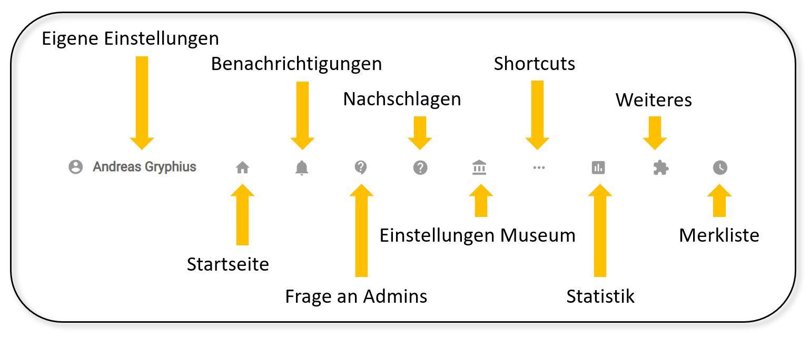

Navigationsleiste
=================

Die Navigationsleiste des Eingabe- und Bearbeitungswerkzeugs von
museum-digital besteht ausschließlich aus Symbolen und dem Namen, unter
dem Sie angemeldet sind. Erläuterungen der dahinter verborgenen
Möglichkeiten erscheinen beim Überfahren der Symbole mit der Maus. Die
erscheinenden Symbole sind an Ihre Nutzerrolle bei museum-digital
angepasst. Manche der Symbole öffnen auf Anklicken ein Menu über welches
Sie weitere Funktionen aufrufen können.

 

Eigene Einstellungen
--------------------

Durch Klicken auf ihren Namen (oder das davor stehende Symbol) gelangen
Sie in das Menu \"Persönliche Einstellungen\". Hier können Sie das
Eingabe- und Bearbeitungswerkzeug von museum-digital ihren Wünschen und
Aufgaben anpassen und hier finden Sie auch den Logout-Schalter, wenn Sie
das Programm verlassen wollen.

### Merkliste

Der Schalter \"Merkliste\" dient dazu die Merklistenfunktion bei
museum-digital zu aktivieren. Ist die Funktion aktiv, dann erscheint am
rechten Rand der Navigationsleiste das Merklistensymbol. Über dieses
Symbol können Sie dann jederzeit die Merkliste ein- oder ausblenden.
Mehr zu Möglichkeiten und Arbeitsweise der Merkliste finden sie
[hier](?lan=de&q=musdb/Objektdaten/Merkliste).

### Schlagwortvorschläge

Wenn Sie ein Objekt erfassen oder bearbeiten, dann können Sie
Schlagworte zum Objekt vergeben. museum-digital bietet eine Funktion,
welche bereits erfasste Texte der Objekt-Grundinformation (z.B.
Objektart, Objektname, Beschreibung \...) auswertet und mit Hilfe der
Lemmatisierungsfunktionen von \"Wortschatz Leipzig\"
(https://wortschatz.uni-leipzig.de - Dank an die KollegInnen) Vorschläge
für die Schlagwortvergabe erstellt. Im Menu \"Persönliche
Einstellungen\" können Sie diese Vorschlagsfunktion generell an- oder
abschalten.

### Globales Ändern

Die Funktion Globales Ändern steht nur Nutzern in der Rolle
Museumsdirektor zur Verfügung. Es handelt sich um eine sehr mächtige
Funktion, mit welcher sich - nach Auswahl der zu ändernden Datensätze -
einzelne Feldeinträge bei vielen Datensätzen gleichzeitig ändern lassen.
Erfahrungsgemäß treten bei solchen Massenänderungen leicht Fehler auf.
Die Funktion ist daher standardmäßig deaktiviert. Wie sie wirkt, wenn
Sie aktiviert wurde, dass erfahren Sie
[hier](?lan=de&q=musdb/Objektdaten/Globales%20%C3%84ndern).

### Menupunkte

 Das Anklicken öffnet sich ein Untermenu:
 

An dieser Stelle können Sie häufig verwendete Funktionen von museum-digital ins
allgemeine Menu (Grundeinstellung: Museum - Sammlung - Objekt) einfügen.
Die entsprechenden Funktionen sind dann stets direkt aufrufbar. Eine
Einbindung dieser Funktionen ins Menu ist jederzeit möglich, wie auch
das Herausnehmen aus der Menuleiste. In jedem Fall bleiben eingegebene
Informationen davon unberührt. Alternativ können Sie aber auch jederzeit
die Shortcuts in der Navigationsleiste verwenden (s.u.) 

###  Sprachwahl

Das Eingabe- und Bearbeitungswerkzeug von museum-digital ist in mehreren
Sprachen verfügbar. Im Untermenu, welches erscheint, wenn Sie auf
\"Sprachwahl\" klicken können Sie zur Zeit wählen zwischen: Indonesisch,
Deutsch, Englisch, Ungarisch, Polnisch und Portugiesisch. Die schnelle
technische Weiterentwicklung von museum-digital führt dazu, dass nicht
immer alles in alle Sprachen übersetzt ist. Deutsch, Englisch und
Ungarisch sind jedoch vollständig berücksichtigt. Weitere Übersetzungen
sind in Vorbereitung.

### Seite bei Programmstart

Hier können Sie die \"Startseite\" festlegen, d.h. jene Seite, die
erscheint, wenn Sie sich im Eingabe- und Bearbeitungswerkzeug anmelden.
Sie können z.B. festlegen, dass Ihnen die Funktionen des Dashboards
stets als erstes angeboten werden (zum Dashboard siehe
[hier](?lan=de&q=musdb/Besondere%20Seiten/Das%20Dashboard)), oder dass
Sie direkt zur Objektübersicht gelangen.

### Kontoeinstellungen

Über diesen Schalter gelangen Sie auf eine Seite zur Pflege Ihrer
eigenen Benutzerangaben. Auf dieser Seite können Sie dann ihr Passwort
ändern, ein Bild von sich im Profil platzieren, eine
Zwei-Faktor-Authentifizierung zur Erhöhung der Sicherheit anschalten,
\... Vor allem aber können Sie Ihr Profil für KollegInnen freischalten
und auf diese Weise mit Ihnen an geeigneten Stellen in Austausch treten.
Diese \"Expertenfunktion\" und weitere Funktionen der Bearbeitung des
eigenen Profils finden Sie
[hier](?lan=de&q=musdb/Besondere%20Seiten/Nutzerkonto).

### Registerkarten

Die Verwaltung von Objektinformation geschieht - in der
Standardeinstellung - über Registerkarten, an dieser Stelle können Sie
einzelne Registerkarten an- oder abschalten. Mehr zum Zweck und Gebrauch
der einzelnen Registerkarten finden Sie
[hier](?lan=de&q=musdb/Objektdaten/Objekte%20bearbeiten%20(1)) und
[hier](?lan=de&q=musdb/Objektdaten/Objekte%20bearbeiten%20(1)).

### Abmelden

Dies ist der Logout-Button.

Startseite
----------

Das Häuschen-Symbol führt zu Ihrer \"Startseite\" des Eingabe- und
Bearbeitungstools. Was dabei als \"Startseite\"-Seite gelten soll, das
können Sie selbst im Menu \"Persönliche Einstellungen\" auswählen. Haben
Sie dort keine Auswahl getroffen, so erscheint das Dashboard.

Benachrichtigungen
------------------

Sobald das Technikteam oder ein Regionaladministrator eine Nachricht an
alle Nutzer schickt erscheint an dieser Glocke ein roter Punkt, der das
Vorliegen neuer Nachrichten symolisiert. Ein Klicken auf die Glocke
zeigt die letzten Nachrichten an.

Frage an Admins
---------------

Das Sprechblasen-Fragezeichen-Symbol öffnet (sofern auf dem aufrufenden
Rechner implementiert) das email-Programm des Nutzers im Modus \"Neue
email verfassen\". Je nachdem, wo sich der Nutzer gerade befand ist die
Betreffzeile dieser Mail-Nachricht bereits ausgefüllt. Fahren Sie mit
der Maus über das Zeichen so erscheint eine Liste der Administratoren,
denen Sie eine mail mit einer Frage schicken können. Klicken Sie auf den
Namen des Administrators öffnet sich das gerade genannte \"Neue email
verfassen\"-Fenster mit aussagekräftiger Betreffzeile. Diese Funktion
soll den Administratoren helfen zu verstehen, welches Problem Sie in der
jeweiligen mail beschreiben.

Nachschlagen
------------

Das ?-Symbol führt zu einzelnen Punkten in diesem Handbuch, die als
Listen zum Nachschlagen ausgelegt sind. Wenn der Mauszeiger das ?-Symbol
berührt öffnet sich ein Menu, aus welchem Sie den Zugang zu einer Liste
auswählen können.

Einstellungen Museum
--------------------

Das Museumssymbol führt auf eine Seite, auf welcher Sie generelle
Einstellungen, die museumsweit gelten, vornehmen können. Dieses Symbol
erscheint nur bei Museumsdirektoren.

Shortcuts
---------

Statt sich - über Persönliche Einstellungen -\> Menupunkte (s.o.) -
verschiedene weitere Bereiche in die Menuleiste hineinzuschalten (etwa:
Literatur) können Sie diese Menupunkte auch über das Aufklappmenu
erreichen, welches erscheint, wenn Sie das Shortcut-Symbol mit dem
Mauszeiger berühren.

Statistik
---------

Das Symbol \"Statistik\" führt zu einer Seite auf welcher Sie
verschiedene Zugänge zur Statistik erhalten.

Weiteres
--------

Ein Berühren der Schalterfläche \"Weiteres\" öffnet ein Aufklappmenu mit
Zusatzfunktionen, etwa den Zugang zur in museum-digital integrierten
Video-Konferenz-Software.

Merkliste
---------

Dieses Symbol erscheint nur, wenn Sie sich die Merklistenfunktion im
Menu \"Persönliche Einstellungen\" freigeschaltet haben. Sie können in
diesem Falle über ein Anklicken dieses Schalters die Merkliste am linken
Bildschirmrand ein- oder ausblenden.

 
